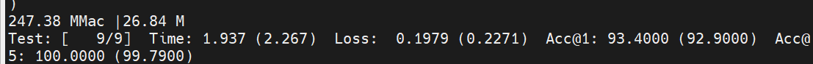
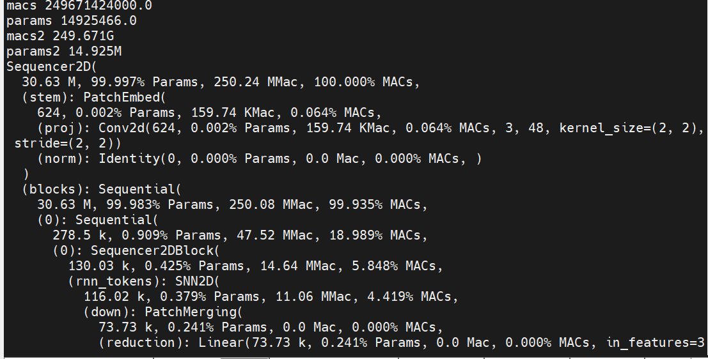

# ECML_SNN
Training a General Spiking Neural Network with Improved Efficiency and Minimum Latency
this is the accompanied code of submission of *Training a General Spiking Neural Network with Improved Efficiency and Minimum Latency*:
## Setup
If you are using Anaconda, you might want to use virtual environment.
```bash
conda create -n SNN python=3.7 -y
conda activate SNN
```
You can install the required dependencies using pip/conda.
```bash
pip install -r requirements.txt
```
## Train a SNN model
### 1. Import the baseline SNN you wanna in ```two_direction_snn.py```
```bash
from models.layers_ecml_cnn_10 import Sequencer2DBlock, PatchEmbed, Downsample2D,SNN2D,PatchMerging
```
### 2.Modify related argument in ```train.py```  (Augmentation & regularization parameters ...)
```bash
parser.add_argument('--sched', default='cosine', type=str, metavar='SCHEDULER',
                    help='LR scheduler (default: "step"')
parser.add_argument('--lr', type=float, default=0.05, metavar='LR',
                    help='learning rate (default: 0.05)')
```
### 3. Train your model
```bash
Python train.py
```
## Validate a SNN model
To prove our research, we provide the pre-train file of two versions (CNN-SNN/LSTM-SNN) on the dataset CIFAR10 and CIFAR100.
Please download the related datasets for validation and load the corresponding model.
### 1(a). If you wanna test CNN-SNN model
#### 1.Import CNN-SNN layer in ```two_direction_snn.py```
```bash
from models.layers_ecml_cnn_10 import Sequencer2DBlock, PatchEmbed, Downsample2D,SNN2D,PatchMerging
```
#### 2.Modify related argument in ```load_model.py```
```bash
'--dataset', default='torch/cifar10', help='dataset type cifar10 or cifar100'
'--load-model', default=None, help='Path of pre training weights'  #set 'output\CIFAR10\CNN\model_best.pth.tar' for this case.
'--num-classes', default=10, help='number of label classes'
```
### 1(b). If you wanna test LSTM-SNN model
The operation is consistent with CNN-SNN except for the path of the model file  
```set 'output\CIFAR10\CNN\cifar_10_not_best_model_best.pth.tar' in this case.```
### 2. Load the model to view relevant results (Acc, Macs, Structure and etc)
```bash
Python load_model.py
```
## Results
The training results are automatically output when training finishes and the ```.csv``` file can be found.
The Validation results are presented in your own IDE console.
Example as:



